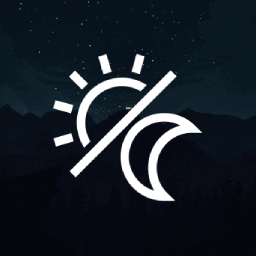

  

<h1 align="center">
  <a href="https://steamcommunity.com/sharedfiles/filedetails/?id=2152947537">Dynamic Firewatch Wallpaper</a>
</h1>

Wallpaper Engine wallpaper with accurate day/night cycle inspired by Firewatch

  

## Description
Wallpaper that fetches sunrise and sunset times from [Sunrise Sunset API](https://sunrise-sunset.org/api) and cycles through [Efacto Daka's Firewatch art](https://www.artstation.com/artwork/1VBvq) as the day progresses.

## Installation
Subscribe to it on [Steam](https://steamcommunity.com/sharedfiles/filedetails/?id=2152947537).

## Contributing
I'm accepting pull requests if you'd like to fix or add a feature. Please open an issue first to discuss the new feature before you put in a lot of work!